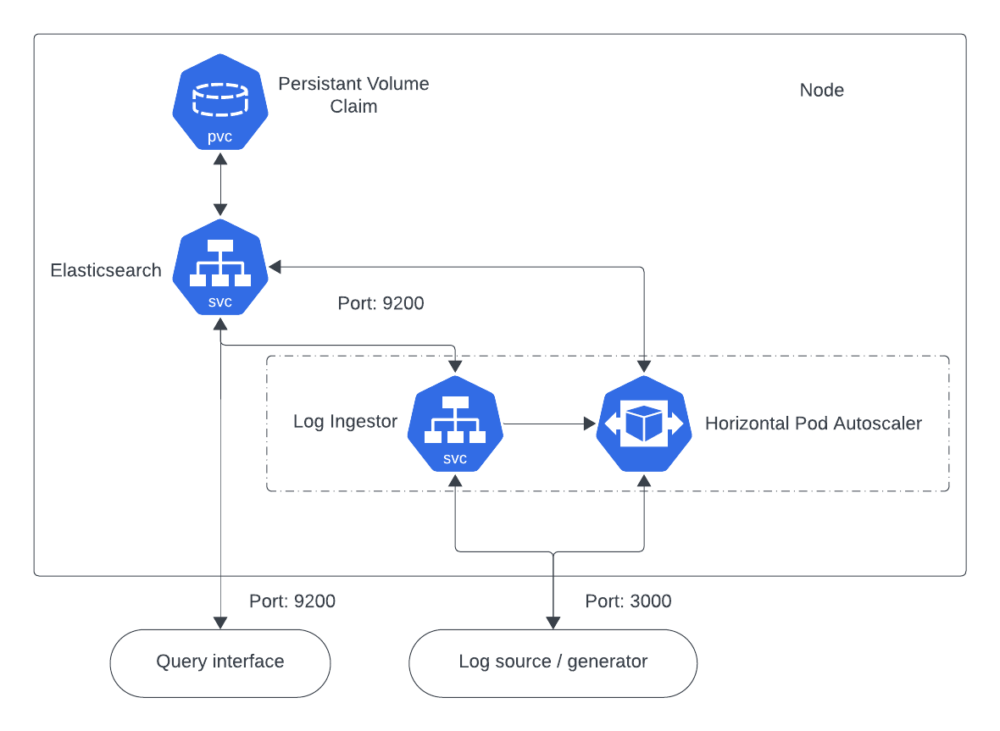
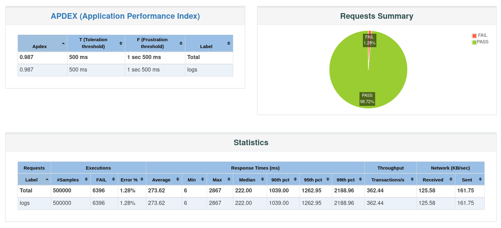
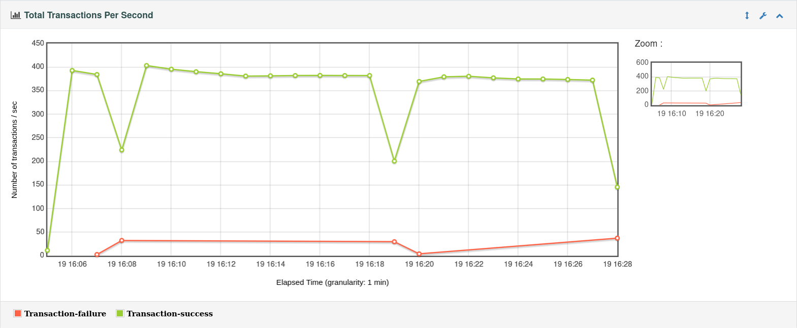
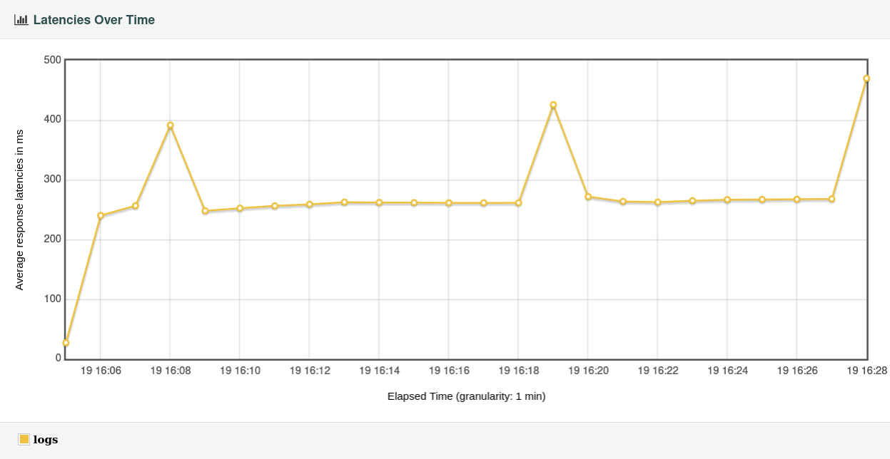
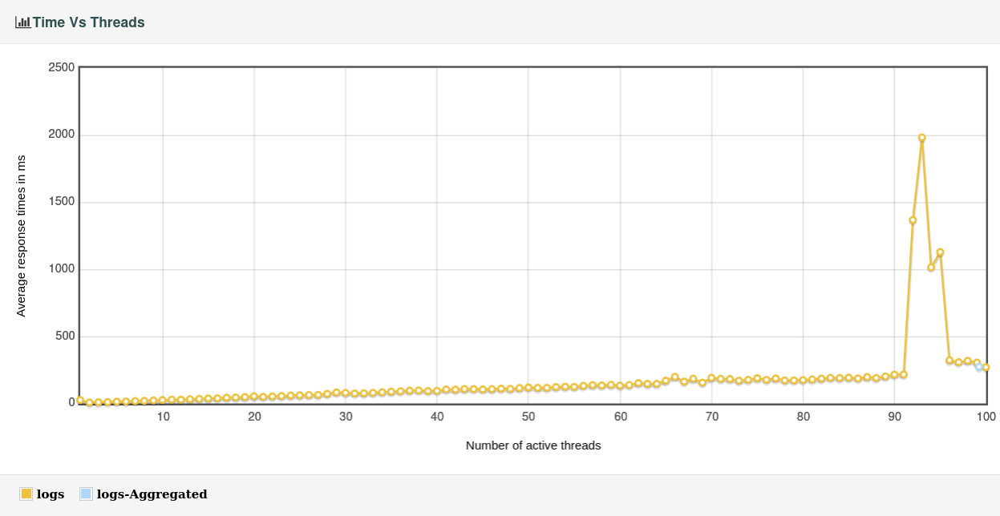

# Log Ingestor and Query Interface

## Log Ingestor Architecture

The log ingestor is made to receive and handle log entries before sending them to Elasticsearch for indexing and storing. Numerous Kubernetes resources and configurations are used in the architecture.



### Components:

1. **Elasticsearch:**

   - Elasticsearch is a distributed search and analytics engine used for storing and retrieving log data.
   - The `elasticsearch.yaml` file defines a Kubernetes Deployment and Service for Elasticsearch, exposing it on port 9200.
   - Persistent storage for Elasticsearch is managed by the `elasticsearch-pvc.yaml` Persistent Volume Claim.

2. **Log Ingestor:**
   - The log ingestor is built using the aiohttp Python framework and runs as a Kubernetes Deployment.
   - The `log_ingestor.py` script defines the behavior of the log ingestor, exposing an endpoint (`/ingest-log`) to receive log entries via POST requests.
   - The log entries are then forwarded to Elasticsearch for indexing.

### Communication Flow:

1. **Log Ingestion:**

   - External systems or applications can send log entries to the log ingestor by making HTTP POST requests to the `/ingest-log` endpoint.
   - The `log_ingestor.py` script processes these requests, constructs Elasticsearch URLs, and forwards the log entries to Elasticsearch.

2. **Elasticsearch Storage:**

   - The log entries are stored in Elasticsearch under the specified index (`logs`) and document type (`_doc`).

3. **Horizontal Pod Autoscaling (HPA):**
   - The `ingestor-hpa.yaml` file defines a HorizontalPodAutoscaler for the log ingestor Deployment.
   - The HPA automatically adjusts the number of log ingestor replicas based on CPU utilization, ensuring efficient resource utilization.

## Files Overview:

- **Elasticsearch:**

  - `elasticsearch.yaml`: Configuration for Elasticsearch Deployment and Service.
  - `elasticsearch-pvc.yaml`: Persistent Volume Claim configuration for Elasticsearch storage.
  - `elasticsearch-service.yaml` : Service configuration for exposing Elasticsearch

- **Log Ingestor:**
  - `log_ingestor.py`: Python script defining the log ingestor behavior.
  - `aiohttp-log-ingestor-deployment.yaml`: Deployment configuration for the log ingestor.
  - `aiohttp-log-ingestor-service.yaml`: Service configuration for exposing the log ingestor.
  - `ingestor-hpa.yaml`: HorizontalPodAutoscaler configuration for automatic scaling of log ingestor pods.

## Usage:

1. Deploy Elasticsearch by applying `elasticsearch-pvc.yaml`, `elasticsearch.yaml` and `elasticsearch-service.yaml`.
2. Deploy the log ingestor by applying `aiohttp-log-ingestor-deployment.yaml` and `aiohttp-log-ingestor-service.yaml`.
3. Apply `ingestor-hpa.yaml` for Horizontal Pod Autoscaling.

Feel free to adjust the configuration files to modify the resources allocated.

To set up the log ingestor and Elasticsearch, start your kubernetes implementation and run the following command:
( Tested using minikube )

```bash
bash setup.sh
```

## Query Interface

The query interface provides a very basic implementation both a Command Line Interface (CLI) and a Graphical User Interface (GUI) for interacting with Elasticsearch.

### Command Line Interface (CLI):

To use the CLI, run the following command:

```bash
python elasticsearch-cli.py
```

### Grahpical User Interface (GUI):

To use the GUI, run the following command:

```bash
python elasticsearch-gui.py
```

# Load Testing Reports

## Log Ingestor Performance Evaluation

Comprehensive load testing was done to evalute the performance of the log ingestor under heavy workload. The following reports provide insights into the ingestor's behaviour, response times, and scalability.

### Test Scenario:

**Apache Jmeter**

Apache Jmeter was used for load testing the ingestor and following were the metrics used to generate load:

- Number of users (threads) :100
- Ramp up period (seconds) :10
- Loop count :500
- Duaration assertion: 1000ms

Summary of the test was as follows:

**Summary**



- As we can see out of 500,000 sample requests made at test metrics previously mentioned, there were only 1.28% of the requests that failed due to taking longer than 1000ms to respond. This shows the reliability of the ingestor to successuly ingest logs and respond within reasonable time (1000ms).

### Performance Metrics:

1. **Throughput:**

   

   - We can se an average successful transactions per second of ~390 and decreaseing only during the intial part of pod scaling that triggers when the current pod's cpu utilizations reaches 70%, and after the replica pods are up and running it returns to its average rate.

2. **Latency:**

   

   - The ingestor latency was maintained under 300 ms throughout the heavy load testing, similar to the throughput rate dropping the latency also increased when autoscaling was still under operation and restored to average after new pods were created. The peaks in latencies again and again reflect the moment where more and more pods were created due to increasing load.

3. **Time Vs Threads:**

   

   - As we can observe the average response time increased sharply when the number of user/threads was increased from 91 to 92 and by the time of threads increasing to 96 it returned to its average response time, this is due to rapid racking up of requests when additional pods were being created to keep up, if we observe closely we can see this pattern of response time increasing when replica sets were being setup and not running, but they are miniscule in comparision to the one observed at the end since the resources being used were reaching its max allocated values.

**Complete Report from Jmeter:**

[Reports](Reports/index.html)

### Insights and Recommendations:

From these results obtained from Jmeter we can conclude that relative to the allocated resources and the weight of the load test, the ingestor has performed well and with reasonable latency for write methods. The anamolies observed in the graphs can be minimized if we set the trigger to start horizontal pod scaling at lower CPU utilization levels (~50%), as opposed to 70% utilization set for the ingestor deployment. After 22 minutes of load testing, the number of failed requests were very low
at 1.28% which showcases the dependability of the ingestor.

Furthermore the following changes may result in improve the already fast query response in elasticsearch:

- Indexing based on the value of "level" of the log along with timestamp, or even a storage based indexing where new indexes are created when the indexing in the inital one reaches a certain threshold of stored logs.
- Employing multi-noded architecture to enable distributed databases i.e sharding.

### Pre-requistes and Requirements:

1.  **Kubernetes (minikube, KIND etc)**
2.  **Kubectl - v1.28.3^**

3.  **[Python packages](/requirements.txt)**

- If Tkinter is not available by default (Linux) use:

```bash
sudo apt-get install python3-tk
```
